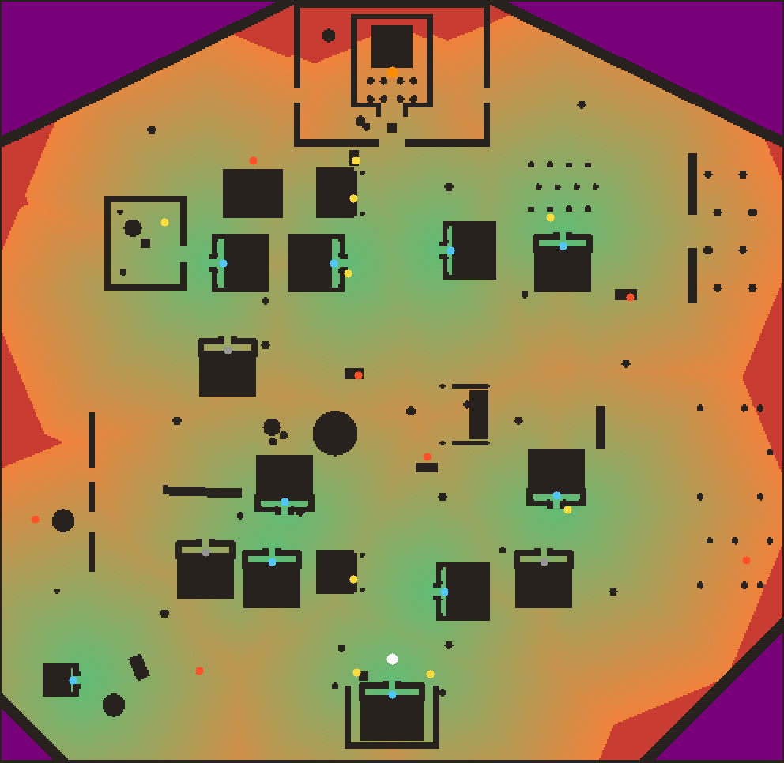

# Moonlight Seva — Level Design

The village: one compact map, walkable end to end, built around one decision the player makes
again and again — *one more offering, or shelter now?*

Data lives in `src/game/world/village/layout.ts`. Collision, navigation, the greybox and the art
are all generated from it, so what you see is what you collide with. The rules below are
enforced by tests (`level.test.ts`, `playthrough.test.ts`); change the layout and they tell you
what broke.



*Map key — green: a shelter door is close; orange: getting far; red: over the 40 m rule; dark:
buildings and walls; blue dots: shelter doors; grey dots: locked doors; gold / red dots: safe /
risky offering spots; white: spawn; orange: the temple offering point. North is up.*
*Regenerate with `LEVEL_MAP=docs/level-map.png npx vitest run tools/level`.*

## Shape

```
                          N
       tank    sweets   TEMPLE   bananas    orchard
     garden             │
     ────── lane B ─────┼───── lane B ──────   ← ring road around the edge
       houses      FESTIVAL GROUND   houses
     ────── lane A ─────┼───── lane A ──────
 fields  houses   kirana │   houses      coconut grove
     ────── south lanes ─ HOME ─ south lanes ─
                          S
```

- **Main road** from home (south) to the temple gate (north), through the festival ground.
- **Two cross lanes** (A and B) and a **ring road** that reaches the temple's side gates, so every
  trip has a genuinely different second route (tested: the alternative avoids the first route's
  corridor and is at most 1.8× as long).
- **Cover is uneven on purpose.** The home streets are dense with houses; the festival ground,
  fields, coconut grove and orchard are open and risky.

## Areas

| Area | Where | Character |
| --- | --- | --- |
| Home | south end | the player's house, compound wall, tulsi; spawn faces the temple spire |
| Festival Ground | centre | open square: pandal, banyan and chabutra, big rangoli, stalls — **no cover** |
| Shri Ganesh Mandir | north end | walled courtyard, platform, mandapa, sanctum; three gates |
| Laxmi Mithai | main road, north | sweet shop near the temple |
| Ganesh Kirana Stores | main road, south | village store |
| Tulsi Garden | north-west | walled garden; gate faces the Shindes' door |
| Village Tank | north-west | stepped pond — open, but near the temple |
| The Fields | west | millet, sugarcane, vegetables, farm hut — **no cover** except the hut |
| Banana Grove | north-east | beside the Naiks' back door |
| Mango Orchard | east | **no cover** |
| Coconut Grove | south-east | **no cover** |

## Shelters

12 houses (3 locked — the families are at the pandal; the door says so) plus the farmhands' hut.
10 shelters in all. Rules, all tested:

- **Every important place is within 40 m of a shelter door.** Moonrise gives ~25 s of warning
  (GAME_DESIGN.md §3.2): 55 m at a walk, 125 m at a run. 40 m leaves room for a late reader of the sky.
- **Nowhere walkable is more than 55 m from shelter** — not even the pradakshina path behind the sanctum.
- **Every door is reachable up its steps**; each has a trigger zone on its veranda.

## Puja item spots

Sixteen spots for the seven puja items, each where it would naturally be: flowers in the tulsi
garden, at the flower stall and by home's tulsi; durva on the tank's grassy bank and the field
edges; coconuts under the palms, at home and at the puja stall; bananas at the fruit stall and the
grove; rice at the kirana; diyas at the potter's and on two doorsteps; modaks at the sweet shop.
There is more of everything than the puja needs (shared/items.ts), so the player chooses a route.
Every tag is a claim the tests check against real walking distance (near-temple ≤ 38 m,
far-from-temple ≥ 80 m, near-shelter ≤ 16 m, risky ≥ 20 m from any shelter):

Home → temple: **93 m** on foot.

| Spot | Puja item | Area | Design tags | Walk to temple | Walk to nearest shelter |
| --- | --- | --- | --- | --- | --- |
| flowers-garden | Flowers ×3 | Tulsi Garden | near-shelter | 58 m | 13 m (the Shindes) |
| flowers-stall | Flowers ×3 | Festival Ground | risky | 52 m | 22 m (the Gokhales) |
| flowers-home | Flowers ×2 | lanes | far-from-temple, near-shelter | 97 m | 8 m (your family) |
| durva-tank | Durva grass ×1 | lanes | near-temple, risky | 34 m | 24 m (the Shindes) |
| durva-field | Durva grass ×2 | The Fields | far-from-temple, risky | 102 m | 30 m (the farmhands) |
| durva-veg | Durva grass ×1 | lanes | far-from-temple, risky | 107 m | 21 m (the farmhands) |
| coconut-grove | Coconut ×1 | Coconut Grove | far-from-temple, risky | 102 m | 35 m (the Jadhavs) |
| coconut-home | Coconut ×1 | Home | far-from-temple, near-shelter | 98 m | 9 m (your family) |
| coconut-stall | Coconut ×1 | lanes | near-temple | 17 m | 19 m (the Gokhales) |
| bananas-stall | Bananas ×4 | lanes | risky | 62 m | 21 m (the Naiks) |
| bananas-grove | Bananas ×2 | Banana Grove | near-shelter | 41 m | 5 m (the Naiks) |
| rice-kirana | Rice ×3 | Ganesh Kirana Stores | far-from-temple, near-shelter | 83 m | 15 m (the Kulkarnis) |
| modak-sweets | Modaks ×6 | Laxmi Mithai | near-temple, near-shelter | 22 m | 13 m (the Gokhales) |
| diya-potter | Diyas ×3 | Festival Ground | risky | 63 m | 25 m (the Kulkarnis) |
| diya-jadhav | Diyas ×2 | lanes | far-from-temple, near-shelter | 84 m | 4 m (the Jadhavs) |
| diya-gokhale | Diyas ×2 | lanes | near-temple, near-shelter | 35 m | 4 m (the Gokhales) |

*Regenerate with `LEVEL_REPORT=out.md npx vitest run tools/level`.*

The interesting spots combine tags: the durva by the tank is close to the temple but exposed; the
rice is far from the temple but safe; the field's durva and the grove's coconut are both far and
exposed. The whole puja (25 items) never fits one bag (15), so there are always at least two trips.

## Shelter rooms

Ten of the thirteen buildings are shelters (every house but the Pawars', the Mores' and the
Manes', plus the farm hut). A shelter's front room is real — built in the colliders
(`solids.ts`), the art (`houses.interior.ts`) and the walk (`shelter/`) from the same
`interiorDims` — and `shelter.test.ts` walks into and out of every one with the camera checked
against every wall. From the street, a shelter reads by its lit doorway lamp and the warm pool of
light on its veranda; the locked houses have a dark lamp, a padlock and dark windows.

## Proven playable

`playthrough.test.ts` drives the real character controller over the real colliders — home → up
the temple steps into the temple trigger; home → every puja item spot → its nearest shelter door (onto
the veranda, into the house zone); a crouched route through the garden gate; the full ring road —
with the camera orbiting the player the whole way and checked against geometry every frame.

## Villagers

Nine villagers preparing for the puja (hanging garlands on the pandal, drawing the rangoli,
minding the shops, lighting the deepastambha, talking by the well, an elder on a veranda). The
ones standing in the open have colliders, and the route tests run with them in place.
